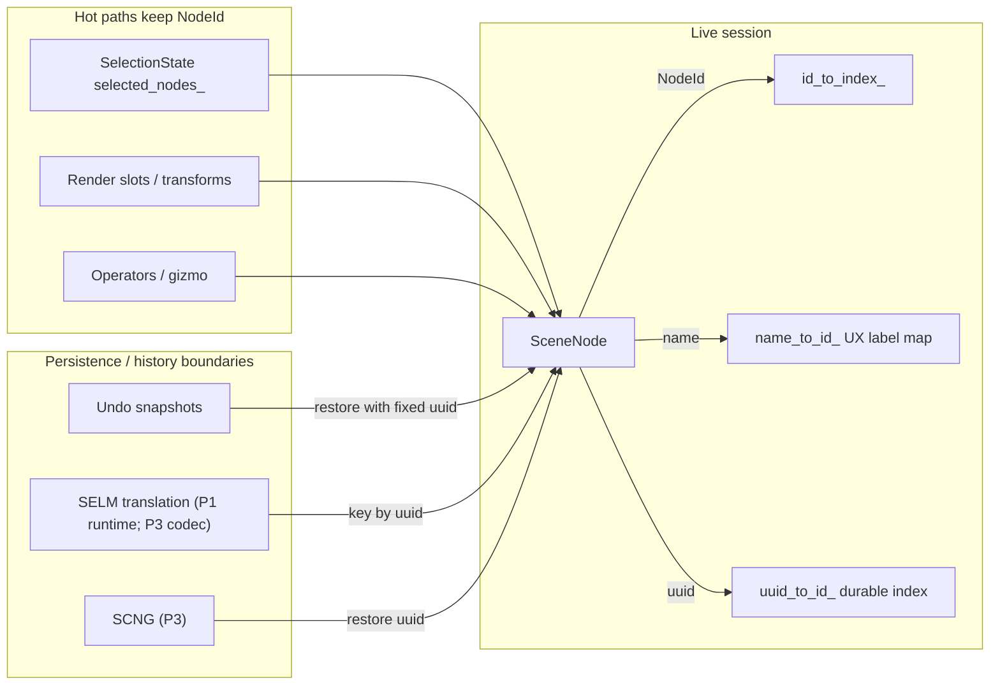
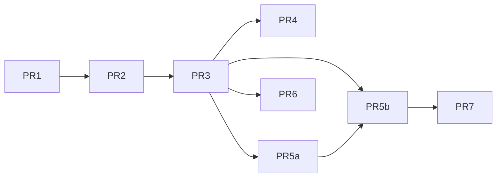
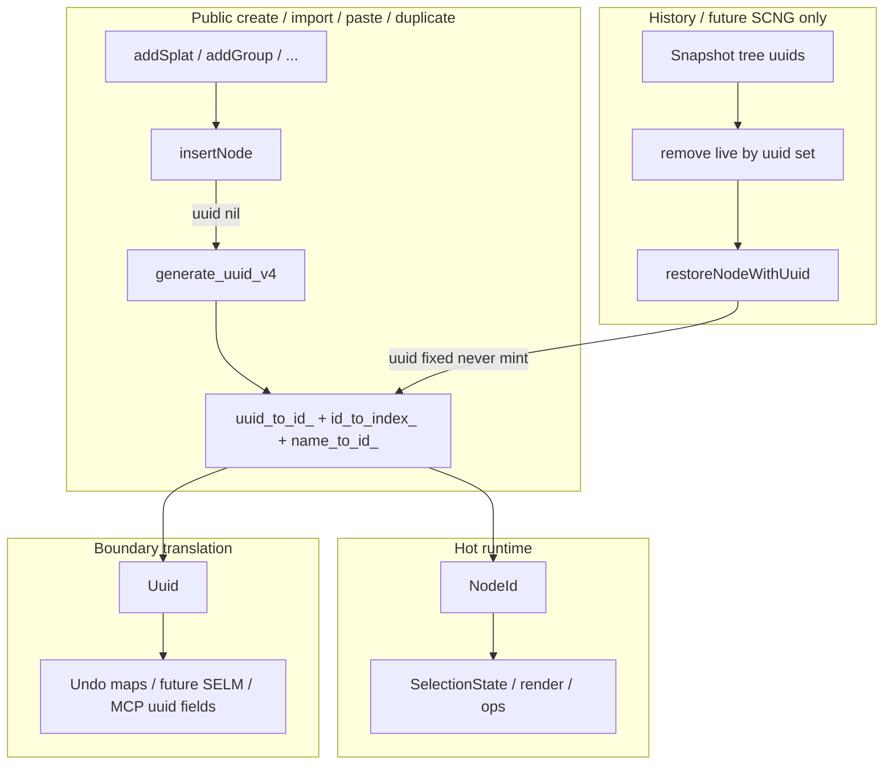

# P1.1 — Node UUID Migration Design

| Field | Value |
|---|---|
| **Status** | Design (implementation not started) |
| **Phase** | P1.1 subset of plan P1 ("State & serializer foundations") |
| **Branch** | `licht_format` |
| **Normative inputs** | `docs/licht_uuid_semantics.md` (D1–D8, TENSIONS, §5.3), `PROJECT_FORMAT_PLAN.md` §1 decisions 6–7, §2.4 SCNG/SELM, §7 P1 exit |
| **Scope** | Runtime dual-identity (`NodeId` + `node_uuid`), mint/preserve lifecycle, undo restore, selection translation boundary, name-as-label migration inventory, Python/MCP additive surfaces |
| **Out of scope** | Container rewrite (P2), `SCNG`/`SELM` on-disk codecs (P3), project/file/commit/snapshot UUIDs beyond the shared generator, `instance_uuid` chunk keys |

This document is **normative for P1.1 implementation**. Rules pinned by the UUID note (D1–D8 unmarked items) are restated as MUST/SHOULD and not re-litigated. Items marked **PROPOSED** in the UUID note remain un-signed-off and are called out explicitly.

---

## 1. Overview

Today the live scene graph has **no persistent 128-bit node identity**. Identity is a dual of:

- session-local dense `NodeId` (`int32_t`, allocated by `next_node_id_++` in `Scene::insertNode`)
- unique display `name` keyed in `Scene::name_to_id_`

Parent/child links, selection, undo restore, training model binding, PLY path maps, sequencer frame tables, events, MCP, and Python plugins all key (or re-resolve) by **name** and/or **NodeId**. `NodeId` is recycled only by `Scene::clear()` (reset to 0); it is **not** recycled on delete, but undo-restore still mints a **new** `NodeId` via public `add*` paths. Names survive rename; they do **not** survive re-import identity semantics the format requires.

P1.1 introduces **dual-identity**:

| Handle | Lifetime | Role |
|---|---|---|
| `NodeId` | Process / session; invalid after delete; may change across undo restore | Hot runtime index into `nodes_`, parent/child vectors, render slots, gizmo selection |
| `Uuid` / `node_uuid` (16 raw RFC 4122 bytes) | Durable across delete→undo, rename, Save/Load (when SCNG exists), project lifetime | Authority for persistence, selection mask re-key at boundaries, history identity, cross-session references |



---

## 2. Background & Motivation

### 2.1 Plan authority

- **Decision 6** (`PROJECT_FORMAT_PLAN.md` §1): persistent 128-bit UUIDs for every scene node; names are display labels; v1 `instance_id = hash(name)` design is deleted.
- **Decision 7**: at most one live row per `{fourcc, instance_uuid}` — multi-instance keys are UUIDs, not names (P2 container).
- **§2.4**: `SCNG` is the durable project DTO (not undo shape); `SELM` keys per-node mask slices by node UUID.
- **§7 P1 exit**: *node UUIDs through scene / undo / selection / sequencer* with stable round-trip; names remain labels only.

### 2.2 Current code facts (verified on `licht_format`)

| Symbol | Location | Behavior |
|---|---|---|
| `using NodeId = int32_t` | `src/core/include/core/scene.hpp:30` | Session handle |
| `SceneNode::{id,parent_id,children,name,…}` | `scene.hpp:97–101` | No uuid field today |
| `Scene::insertNode` | `src/core/scene.cpp:165–208` | `id = next_node_id_++`; rejects duplicate **names**; registers `name_to_id_` |
| `Scene::removeNode` / `removeNodeInternal` | `scene.cpp:211–322` | Lookup by **name**; frees name key; does **not** recycle `NodeId` |
| `Scene::duplicateNode` | `scene.cpp:2364–2471` | `generate_unique_name(base + "_copy")` → `addGroup`/`addSplat`/… → **new** `NodeId`s; `markPayloadDiverged` on splat copies |
| `Scene::renameNode` | `scene.cpp:1798–1841` | Rebinds `name_to_id_`; **preserves** `NodeId` |
| `Scene::clear` | `scene.cpp:426–449` | Clears maps; `next_node_id_ = 0` |
| `makeUniqueNodeName` | `scene.cpp:29–36` | Display-name uniquifier |
| `SceneGraphNodeSnapshot` | `undo_entry.hpp:380–408` | `name`, `parent_name`, type, transform, flags, **`payload_diverged`**, payloads — **no UUID, no NodeId** |
| `restoreNodeSnapshot` | `undo_entry.cpp:1048–1154` | Public `scene.add*` by name → **new NodeId** |
| `SceneGraphPatchEntry::applyState` | `undo_entry.cpp:2221–2271` | Builds `names_to_remove` from **display names** of desired/current roots (`2228–2237`), then `scene.removeNode(name)` — **clobbers** live nodes that reused a deleted name |
| `SelectionState::selected_nodes_` | `selection_state.hpp:42` | `unordered_set<NodeId>` — **stale after undo-restore** |
| `Scene::selection_mask_` | `scene.hpp:461` | Global concatenated tensor, not per-node UUID slices |
| `Scene::getSelectionGaussianCount` | `scene.cpp:897–905` | Sums `gaussian_count` over **all** `NodeType::SPLAT` nodes in `nodes_` vector order (includes hidden) |
| `Scene::training_model_node_` | `scene.hpp:494` | **string name** |
| Hard-coded training names | `training_setup.cpp:424–524, 757–886` | `"loaded_model"`, `"Model"`, `"PointCloud"`, `"Cameras"` |
| `SceneManager::removeNode(NodeId, …)` | `scene_manager.hpp:134` | Id overload (not named `removeNodeById`) |
| `SceneManager::renamePLY` → `movePlyPath` | `scene_manager.cpp:3652–3679` | Name-keyed ply path rebind on rename |
| No core `Uuid` / `generate_uuid_v4` | repo search under `src/core` | Only unrelated Vulkan device UUID interop and v1 `project_uuid[16]` in container prototype |

### 2.3 Tensions this packet resolves (direction fixed by UUID note)

| Tension | Resolution in P1.1 |
|---|---|
| **TENSION-IDENTITY** | Add `SceneNode::uuid` + index; mint in `insertNode` unless restore supplies UUID |
| **TENSION-UNDO** | History-private snapshots gain uuid; **remove + restore by uuid** (not name); identity-preserving restore API; selection rebind by uuid |
| **TENSION-SELM** | Runtime may keep flat mask; introduce per-node slice capture/restore + uuid keying at translation boundary (on-disk `SELM` codec remains P3) |
| **TENSION-IMPORT-STABLE-NAMES** | Re-import always fresh UUIDs even when display names match (`"Model"`, path stem) |
| **TENSION-INSTANCE-ID** | Out of P1.1 (P2) — note only |
| **TENSION-HASH-NAME** | Already absent in code — do not introduce hash(name) shims |

---

## 3. Goals & Non-Goals

### 3.1 Goals

1. Every live `SceneNode` carries a durable `Uuid` assigned per D1/D8 (or restored per D3/D4).
2. `NodeId` remains the only hot-path handle for parent/child, render, operators, and in-process selection sets.
3. Undo/redo of delete/recreate **preserves** `node_uuid` (D4): history **removes and restores by uuid**, never by display name alone.
4. Duplicate / paste / import **mint fresh** UUIDs (D2/D3/D7).
5. Selection persistence boundary can key mask slices by `node_uuid` (D6 runtime half); full topology mask slices from S3.
6. Name-as-identity inventory (§5.3, verified below) is classified: **replace** vs **supplement**; migration is staged, dependency-ordered, compile/test green per stage.
7. Python / MCP plugin surfaces stay **additive** (no signature removals or return-type changes for existing name/`NodeId` args); external uuid only after S2.
8. Shared `generate_uuid_v4()` is process-wide, OS CSPRNG, usable later for project/file/commit/snapshot UUIDs (D1, D5/D8 generator only — not full project UUID lifecycle).
9. Single public `Scene::restoreNodeWithUuid` for all non-minting inserts (history + future SCNG).

### 3.2 Non-Goals (P1.1)

| Non-goal | Owner phase |
|---|---|
| `SCNG` / `SELM` / `SPLT` chapter codecs and on-disk serialization | P3 |
| Container superblock / `instance_uuid` chunk keys | P2 |
| Full `.licht` open/save round-trip of node UUIDs | P3 + P6 lifecycle |
| Cross-project OS clipboard paste | Future (D7 reserved) |
| **PROPOSED** `duplicated_from_uuid` field in SCNG | Needs owner sign-off; not required for P1.1 exit |
| **PROPOSED** Duplicate Project deep-copy re-keying | Needs owner sign-off; project-level |
| Dropping display-name uniqueness as a UX constraint | Open Question OQ-1 |
| Renaming user-visible default labels (`"Model"`, `"Pasted_N"`, …) | Non-goal — labels may stay; identity changes under them |
| Breaking Python/MCP method signatures | Forbidden |
| Introducing temporary `hash(name)` identity | Forbidden (TENSION-HASH-NAME) |

---

## 4. Proposed Design

### 4.1 Identity model (dual-identity)

#### 4.1.1 Types

Introduce in core (suggested placement: `src/core/include/core/uuid.hpp` + `src/core/uuid.cpp`):

```cpp
namespace lfs::core {

struct Uuid {
    std::array<std::uint8_t, 16> bytes{};

    [[nodiscard]] bool is_nil() const noexcept;
    [[nodiscard]] std::string to_string() const; // canonical 8-4-4-4-12 lowercase hex
    [[nodiscard]] static std::optional<Uuid> from_string(std::string_view);

    friend bool operator==(const Uuid&, const Uuid&) = default;
    // hash specialization for unordered_map
};

// D1 + D8: OS CSPRNG, version nibble=4, RFC 4122 variant bits.
// Thread-safe (mutex or OS serialization). Not shared with training PRNGs.
[[nodiscard]] Uuid generate_uuid_v4();

} // namespace lfs::core
```

**Rules (MUST):**

- Generator MUST use OS CSPRNG: `getentropy` / `getrandom` (POSIX), `BCryptGenRandom` (Windows). Fallback to `std::random_device` **only** where documented non-deterministic (D8).
- Stored as **16 raw RFC 4122 bytes** (big-endian field order); never host-endian `uint64_t[2]` reinterpret without encode/decode (D8).
- Debug builds MAY assert on in-process duplicate `node_uuid` in one live scene (D8). No global uniqueness table, no cross-process coordination.

**There is no existing core Uuid type today** — only:

- v1 container `project_uuid[16]` (`src/io/include/io/project_container.hpp`)
- Vulkan/CUDA device UUID interop (`src/rendering/cuda_vulkan_interop.*`)

Neither is reused for node identity.

#### 4.1.2 Field placement

```cpp
// SceneNode — src/core/include/core/scene.hpp
class SceneNode {
public:
    NodeId id = NULL_NODE;           // transient
    NodeId parent_id = NULL_NODE;    // transient
    std::vector<NodeId> children;    // transient
    Uuid uuid;                       // NEW — durable; non-nil after successful insert
    NodeType type = NodeType::SPLAT;
    std::string name;                // display label (UX uniqueness — see OQ-1)
    // … existing payload / transform fields unchanged …
};
```

#### 4.1.3 Scene-level index

```cpp
// Scene private members
std::unordered_map<NodeId, size_t> id_to_index_;
std::unordered_map<std::string, NodeId> name_to_id_;   // UX lookup; not durable identity
std::unordered_map<Uuid, NodeId> uuid_to_id_;            // NEW durable reverse index
NodeId next_node_id_ = 0;
```

**Public accessors (additive):**

| API | Behavior |
|---|---|
| `getNodeByUuid(const Uuid&)` / `const` | Lookup via `uuid_to_id_` then `id_to_index_` |
| `getNodeIdByUuid(const Uuid&)` | `NodeId` or `NULL_NODE` |
| Existing `getNode(name)`, `getNodeById`, `getNodeIdByName` | **Unchanged signatures** |

#### 4.1.4 Generation call sites

| Path | UUID assignment |
|---|---|
| Public create (`addGroup`, `addSplat`, `addSplatPlaceholder`, …) → `insertNode` | **Mint** `generate_uuid_v4()` if `node->uuid` is nil |
| History / SCNG restore via **`Scene::restoreNodeWithUuid` only** | **Preserve** caller-supplied non-nil uuid; **MUST NOT** mint |
| Future `.licht` SCNG hydrate (P3) | **Preserve** file uuid via `restoreNodeWithUuid` only |
| `Scene::clear` | Clear `uuid_to_id_`; no UUID reservation across clears (history/redo may still hold tombstone uuids — see §4.1.6) |

#### 4.1.5 `insertNode` contract (normative)

Current (`scene.cpp:165–208`): validates non-null, non-empty name, unique name, valid parent; assigns `NodeId`; registers maps. **`insertNode` remains private** (`scene.hpp:443`).

**P1.1 MUST extend private `insertNode`:**

1. If `node->uuid.is_nil()`, assign `node->uuid = generate_uuid_v4()`.
2. If non-nil uuid already present:
   - If `uuid_to_id_` already contains it → **reject** (programming error / corrupt restore); log + return `NULL_NODE` (debug assert).
   - Else register `uuid_to_id_[uuid] = id`.
3. Name uniqueness: **keep current reject-duplicate-name behavior** until OQ-1 decides otherwise (still UX map, not identity).
4. `removeNodeInternal` MUST erase `uuid_to_id_` entry when removing the node. Prefer also exposing `removeNodeById(NodeId)` / remove-via-uuid helper so history never needs name for identity remove.
5. `renameNode` MUST NOT touch uuid or `uuid_to_id_`.
6. `clear` MUST clear `uuid_to_id_`.

**Invariant:** After any successful insert, `node.uuid` is non-nil and `uuid_to_id_[uuid] == node.id`.

**Public `add*` contract (MUST):** every public create path (`addGroup`, `addSplat`, `addSplatPlaceholder`, `addMesh`, …) MUST leave `node->uuid` **nil** before calling `insertNode`, so mint always happens inside `insertNode`. Callers MUST NOT pre-assign uuid on public create paths.

#### 4.1.6 Uniqueness enforcement

| Scope | Rule |
|---|---|
| Live scene `node_uuid` | Unique among live nodes (enforced by `uuid_to_id_`) |
| History-private snapshots / redo stack | May retain UUIDs of deleted nodes as **tombstones** in history only; they do **not** reserve against new mints (birthday collision only — D8) |
| Live reintroduction | Live graph MUST NOT host a different logical node under a uuid still owned by a concurrent restore of the same snapshot tree; restore of uuid U removes any live node with uuid U first (see §4.3.3) |
| Birthday collisions | Accepted (D8); no coordination |

#### 4.1.7 Single restore API (normative — no cross-module friend)

`Scene::insertNode` is private. Undo lives in `lfs::vis` and must not friend-hack into core.

**MUST provide exactly one exportable, non-minting restore entry point** on `Scene` (`LFS_CORE_API`):

```cpp
// Public core API — history + future SCNG load only.
// Rejects nil uuid. NEVER mints. Rejects if uuid already live (unless replacing
// that same live node as part of an explicit remove-then-restore sequence).
// parent is resolved NodeId (caller resolves parent_uuid first).
[[nodiscard]] NodeId Scene::restoreNodeWithUuid(
    Uuid uuid,                       // required, non-nil
    NodeType type,
    std::string name,                // display label; may be uniquified by caller on conflict
    NodeId parent,                   // NULL_NODE = root
    /* typed payload: unique_ptr<SplatData> / shared_ptr<MeshData> / … as overloads
       or a small RestoreNodeDesc struct — implementation choice, one family of APIs */);
```

**Rules (MUST):**

1. All identity-preserving inserts go through `restoreNodeWithUuid` (or thin type-specific overloads that all share one non-minting insert path).
2. **Ban** cross-module `friend` between `lfs::vis` and `Scene` for insert.
3. **Ban** “set uuid after public `add*`” — mint-on-nil already ran inside `insertNode`.
4. Public `add*` remain the only minting create surface for app/UI/MCP/Python.
5. Debug builds SHOULD assert if `generate_uuid_v4()` ever collides with a live `uuid_to_id_` key (programming error / astronomical birthday).
6. **Scope of the API (audit F3):** `restoreNodeWithUuid` is the identity-preserving *insert*
   only — the mirror of the `add*` call it replaces. The caller (undo restore; later the SCNG
   loader) still post-sets node state exactly as `restoreNodeSnapshot` does today
   (`undo_entry.cpp:1134-1145`: `local_transform`, `visible`, `locked`, `training_enabled`,
   `payload_diverged`, `centroid`, `gaussian_count`, ply path) and recurses children. It is NOT
   a complete node restore.

---

### 4.2 Lifecycle wiring

Every path the UUID note enumerated, plus gaps found vs live code, mapped to **current** mint/preserve behavior and **target** behavior.

| Event | Current code (file:symbol) | Target `node_uuid` | Display name |
|---|---|---|---|
| Create group/splat/mesh/camera/… | `Scene::add*` → `insertNode` (`scene.cpp`) | **fresh v4** | caller / uniquified |
| Splat placeholder | `Scene::addSplatPlaceholder` (`scene.cpp:2095–2106`); PLY sequence frames (`sequencer_ui_manager.cpp:2045`) | **fresh** | uniquified frame names |
| Keyframe create | `Scene::addKeyframeGroup` / `addKeyframe` (`scene.hpp:221–222`) | **fresh** | caller / uniquified |
| `SceneManager::loadSplatFile` | `scene_manager.cpp:688+` — `clear()` then `addMesh`/`addSplat` with `path.stem()` | **fresh** (post-clear) | stem |
| `SceneManager::addSplatFile` | `scene_manager.cpp:934+` | **fresh** | uniquified hint/stem |
| Multi-format splat import (.ply/.sog/.spz/.rad) | Same funnels: `loadSplatFile` / `addSplatFile` extension switch (`scene_manager.cpp:722–731`) | **fresh** (no separate code paths) | stem |
| Dataset / COLMAP full | `loadDataset` → `lfs::training::loadTrainingDataIntoScene` (`training_setup.cpp:410+`) | **fresh** for dataset, Model/PointCloud, Cameras, camera nodes | filename / hard-coded / image names |
| COLMAP cameras only | `SceneManager::loadColmapCamerasOnly` (`scene_manager.cpp:2734+`) | **fresh** for camera tree | image / group names |
| Checkpoint resume | `SceneManager::loadCheckpointForTraining` (`scene_manager.cpp:2836+`) — clear, reload dataset, `setTrainingModel(..., "Model")` | **fresh** for all recreated nodes after clear | `"Model"` etc. |
| `setTrainingModel` existing node | `Scene::setTrainingModel` → `replaceNodeModel` (`scene.cpp:3381–3389`, `337–370`) | **preserve** uuid of existing splat node | name may stay |
| `replaceNodeModel` / `swapNodeModel` | `scene.cpp:337–386`; sequencer playback `swapNodeModel` (`sequencer_ui_manager.cpp:952`) | **preserve** uuid (payload/topology size may change; selection mask resized separately) | unchanged |
| PLY sequence container | `addPlySequenceNode` (`scene_manager.cpp:3819+`) | **fresh** | uniquified |
| `duplicateNode` / `duplicateNodeTree` | `scene.cpp:2364`; `scene_manager.cpp:3942` | **fresh** per node in subtree (D2) | `name_copy` uniquified |
| Paste nodes/gaussians | `pasteNodes` / `pasteGaussians` (`scene_manager.cpp:4719`, `4596`) | **fresh** (D7 in-process) | `Pasted_N` / `Selection_N` |
| Mirror (in-place) | `executeMirror` (`scene_manager.cpp:4657`) | **unchanged** (edits payload; `markPayloadDiverged`) | unchanged |
| Merge group | `Scene::mergeGroup` (`scene.cpp:2473`) — remove group, `addSplat(group_name, …)` | **fresh** for merged splat (new node); old UUIDs gone with removed subtree | reuses group display name |
| Rename | `Scene::renameNode` (`scene.cpp:1798+`); manager `renamePLY` → `movePlyPath` (`scene_manager.cpp:3652–3679`) | **unchanged**; ply-path map must rebind by **uuid** after S4 (today rebinds by name) | new label |
| Reparent / reorder | `reparent` / `moveNode` | **unchanged** | unchanged |
| Delete | `removeNode` / `removePLY` (`scene_manager.cpp:1423`); manager `removeNode(NodeId)` (`scene_manager.hpp:134`) | removed from live graph; history retains uuid | freed from `name_to_id_` |
| Undo delete / topology patch | `SceneGraphPatchEntry` + `restoreNodeSnapshot` | **same UUID restored** (D4) — today: **broken** (remove-by-name + new NodeId) | label policy OQ-2 |
| Undo context rebind | `applyState` → `setTrainingModelNode(name)` (`undo_entry.cpp:2255`) | **rebind by `training_model_uuid`** (dual-write during migration) | name secondary |
| Redo delete | inverse of undo | removed again | |
| IMAGE / IMAGE_GROUP | Types in `scene.hpp:42–43`; UI/MCP display cases only — **no** `addImage` / `addImageGroup` in core | **N/A today**; if added later, mint on insert like other `add*` | future |
| Open `.licht` | **not implemented** for SCNG yet | restored from SCNG (P3) via `restoreNodeWithUuid` | restored |
| Relink `REFS` | P3 | **unchanged** uuid | usually unchanged |

#### 4.2.1 Trained-model / hard-coded names

| Literal | Sites (current) | UUID behavior |
|---|---|---|
| `"loaded_model"` | `training_setup.cpp:424–425`, `803–804` | Fresh uuid each load; name is only a label |
| `"Model"` | `training_setup.cpp:466–487`, `757–761`, `842–862`; `loadCheckpointForTraining` `MODEL_NAME` at `scene_manager.cpp:2921–2923` | Fresh uuid each load/resume construction |
| `"PointCloud"` | `training_setup.cpp:495–500`, `868–870` | Fresh |
| `"Cameras"` / `"Training (N)"` / `"Validation (N)"` | `training_setup.cpp:524–538` | Fresh |
| Camera `image_name()` | `addCamera(cameras[i]->image_name(), …)` | Fresh uuid; name from COLMAP |

**Training model binding** today: `Scene::training_model_node_` is a **string** (`scene.hpp:494`; `setTrainingModelNode` at `scene.cpp:3376`). P1.1 MUST migrate authority to uuid (or NodeId resolved from uuid) while keeping name getter for display — see §4.6.

#### 4.2.2 Delete + undo-restore (detail) — remove **and** restore by uuid

Current delete-with-history path (`scene_manager.cpp` around `removeNodeImpl` / `SceneGraphPatchEntry::captureState`):

1. Capture before snapshot by **root names**.
2. Remove via `scene.removeNode(name)`.
3. Capture after / push patch entry.
4. Undo → `applyState(before, after)` → **`names_to_remove` from display names** of desired/current roots (`undo_entry.cpp:2228–2237`) → `scene.removeNode(name)` → `restoreNodeSnapshot` via **public add\*** → **new NodeId, no uuid**.

**Bug (critical):** if the user creates unrelated node B with deleted node A’s old display name, undo **deletes B** before “restoring A”. Nested children of A are not in `names_to_remove` but then fail `insertNode`’s unique-name reject when labels collide.

**Target (MUST — D4 completeness):**

1. Capture stores **`uuid` + `parent_uuid` for every node in the patch tree** (roots and nested children), plus display names as labels only.
2. **`applyState` removes live nodes by uuid, never by display name alone:**
   - Build `uuids_to_remove` = union of all uuids in `desired` tree and `current` tree (full trees, not roots-only names).
   - For each uuid in that set present in the live scene: resolve `uuid_to_id_` → remove by **NodeId** (subtree policy matching today’s `removeNode(..., keep_children=false)` for captured roots).
   - **MUST NOT** call `scene.removeNode(display_name)` for identity.
3. Restore each desired node via `restoreNodeWithUuid` (parent-first); re-register `uuid_to_id_`.
4. Node multi-select restored by resolving stored uuids → new NodeIds (§4.3).
5. Per-node gaussian mask slices for deleted splat subtrees: captured when present (§4.3.2, §4.4) — full D4 after S3, partial until then (§15).

**Mandatory test (S2):** create A → delete A → create B with A’s old name → undo delete → **A restored with original uuid; B still live** (B’s label may be uniquified only if restore claims A’s label under OQ-2; B’s **uuid must not change**).

---

### 4.3 Undo/redo — snapshot shape (fix TENSION-UNDO)

#### 4.3.1 Pattern to follow: `payload_diverged`

Recent history already carries a non-topology flag through capture/restore without overloading SCNG:

- Field on live node: `SceneNode::payload_diverged` (`scene.hpp:117`)
- On full graph snapshot: `SceneGraphNodeSnapshot::payload_diverged` (`undo_entry.hpp:395`)
- On metadata snapshot: `SceneGraphNodeMetadataSnapshot::payload_diverged` (`undo_entry.hpp:429`)
- Metadata capture: `captureNodeMetadataSnapshot` sets `payload_diverged` at `undo_entry.cpp:810`
- Full capture: `captureNodeSnapshot` sets `payload_diverged` at `undo_entry.cpp:844` (function starts ~834)
- Restore: `restored->payload_diverged = snapshot.payload_diverged` (`undo_entry.cpp:1138`)
- `SceneSnapshot` topology path dual-maps before/after by **name** (`undo_entry.hpp:190–196`; capture at `undo_entry.cpp:1297–1302`; apply at `1581–1585`)

**UUID migration MUST follow the same pattern:** add fields to the **history-private** structs; capture/restore them; do **not** make SCNG the undo buffer (plan §2.4, D4).

#### 4.3.2 Struct changes

| Struct | New fields | Notes |
|---|---|---|
| `SceneGraphNodeSnapshot` | `Uuid uuid`; `Uuid parent_uuid` (nil = root); optional `shared_ptr<Tensor> selection_slice` | Keep `name`/`parent_name` for events/UI only. Slice: per D4 when splat had non-zero mask coverage (required from S3; see §4.4.4 for S2 partial) |
| `SceneGraphNodeMetadataSnapshot` | `Uuid uuid`; `Uuid parent_uuid` | Same label split |
| `SceneGraphContextSnapshot` | `Uuid training_model_uuid` (alongside name during dual-write) | `applyState` MUST rebind training model by uuid once dual-write lands |
| `SceneGraphStateSnapshot` | `optional<vector<Uuid>> selected_node_uuids` | Authority for node multi-select rebind; `selected_node_names` transitional only |
| `SceneSnapshot` maps | Migrate `transforms_*`, `deleted_masks_*`, `payload_diverged_*` from `string` → `Uuid` | **Dual-map window:** S2 may dual-write name+uuid; **S4a deletes name keys**. Rename-then-undo of transform/deleted-mask **MUST** be tested once uuid keys land |

#### 4.3.3 Restore re-bind flow (remove by uuid)

```mermaid
sequenceDiagram
  participant H as UndoHistory
  participant P as SceneGraphPatchEntry
  participant S as Scene
  participant Sel as SelectionState

  H->>P: undo()
  P->>S: Transaction
  P->>S: collect uuids from desired+current trees
  P->>S: remove live nodes by uuid→NodeId
  Note over S: uuid_to_id_ entries erased for removed
  loop each node in desired.roots depth-first parent-first
    P->>S: restoreNodeWithUuid(snapshot.uuid, ...)
    Note over S: new NodeId; same uuid; uuid_to_id_ rebound
    P->>S: apply selection_slice under uuid if present
  end
  P->>S: setTrainingModel by training_model_uuid
  P->>Sel: clear + select by resolved selected_node_uuids
  Note over Sel: NodeIds are new; uuids match snapshot
```

**Rules (MUST):**

1. Topology apply MUST remove by **uuid set**, not display name (§4.2.2).
2. Node restore MUST call `Scene::restoreNodeWithUuid` only — never public minting `add*`.
3. Parent resolution: `parent_uuid` → `getNodeIdByUuid`; `parent_name` is transitional fallback only (remove after S2).
4. `applyState` MUST make remove+restore **failure-free by construction**: BEFORE removing any
   node, pre-validate that the entire desired tree is restorable — every `parent_uuid` resolvable
   in restore order, every snapshot payload present and well-formed, and every display name
   insertable after the §4.3.4 pre-insert uniquify. Only after validation passes may removal
   begin; a validation failure aborts the undo entry before any mutation. `Scene::Transaction`
   (`scene.cpp:135-144`) is mutation-event **batching only** — no snapshot, no rollback — and
   MUST NOT be described or relied on as a rollback mechanism; the outer safety net remains the
   existing `UndoHistory`/`CompoundUndoEntry` compensation (`undo_history.cpp:83-129`),
   unchanged. See OQ-9 (intent unchanged: no partial tree may remain — the mechanism is
   pre-validation, not a nonexistent transactional rollback).
5. After restore, `SelectionState` MUST be re-filled from `selected_node_uuids`. Holding old `NodeId`s across topology undo is a known bug today (`selection_state.hpp:42`).
6. **Redo-after-new-edits / history invalidation:** existing `UndoHistory` rules (push clears redo; transactions; failure compensation in `test_undo_history.cpp`) are **unchanged**. Redo entries may hold tombstone uuids; those uuids are **not** reserved against new mints (birthday only).
7. Debug assert if mint produces a uuid already in live `uuid_to_id_`.

#### 4.3.4 Display-name conflict on undo restore (OQ-2 — residual labels only)

After uuid-targeted remove, an **unrelated** live node B (different uuid) may still occupy the display name A wants.

- **Identity is not in question:** A restores under A’s uuid; B is never deleted solely for label reuse.
- **Residual policy (OQ-2, NORMATIVE — not optional):** the restore path MUST detect the live-name
  collision and uniquify A’s display name via `makeUniqueNodeName` **before** the
  `restoreNodeWithUuid` insert. `insertNode` still rejects duplicate names (OQ-1), so an
  un-uniquified restore would throw on exactly the clobber case this design fixes (audit F2).
  Uuid never changes; log/UI note. The pre-insert uniquify is part of the §4.3.3 rule-4
  pre-validation (name insertability is checked before any removal).

**Explicit test (S2 clobber regression):** create A → delete A → create B with A’s old name →
undo → A restored under A’s uuid (label possibly uniquified — assert uuid stability, not label
equality); B and B’s uuid untouched.

---

### 4.4 Selection / SELM (TENSION-SELM)

#### 4.4.1 Runtime shape (performance)

Keep:

- Global `Scene::selection_mask_` as flat uint8 tensor over current gaussian topology (render/paint hot path).
- `SelectionState::selected_nodes_` as `unordered_set<NodeId>` for multi-node UI selection.
- Selection groups (`selection_groups_`, active group id) as today.
- Existing `SceneSnapshot` dense/sparse **global** mask undo for paint ops — unchanged.

#### 4.4.2 Canonical flat-mask layout (normative)

Live flat mask length MUST match `Scene::getSelectionGaussianCount()` (`scene.cpp:897–905`):

```
total = 0
for node in nodes_ in vector order:
  if node->type == NodeType::SPLAT:
    total += node->gaussian_count
```

**Rules (MUST):**

1. **Include hidden SPLAT nodes** (same as `getSelectionGaussianCount` — not visibility-filtered).
2. **Exclude** non-SPLAT types (POINTCLOUD, MESH, GROUP, CAMERA, …) from mask ranges.
3. Slice for a SPLAT node is the contiguous half-open range `[offset, offset + gaussian_count)` where `offset` is the sum of `gaussian_count` of all prior SPLAT nodes in `nodes_` order.
4. **Consolidation:** when `consolidated_ == true`, runtime paint may use combined model + `transform_indices` (`scene_manager.cpp` copy path ~4517+). Capture helpers MUST still emit slices keyed by **owning node uuid** using the same `nodes_` SPLAT order and each node’s `gaussian_count` / model size. If consolidated topology disagrees with per-node counts, treat as invariant violation (log + fail capture) rather than inventing a second order. **Required invariant (audit F4): `consolidateNodeModels` builds the combined model in `nodes_` SPLAT order (`scene.cpp:547-556`) — this ordering is normative for the flat-mask layout, and guards MUST NOT treat total-count equality alone as proof of layout agreement (matching total ≠ matching order).**
5. **`replaceNodeModel` / `swapNodeModel`:** uuid unchanged; if `gaussian_count` changes, live flat mask is resized via existing `resizeSelectionIfSizeMismatch` (`scene.cpp:907+`) — **history slices captured before the swap remain valid only for the pre-swap size**; topology undo that restores an older model MUST restore the slice captured with that snapshot, not the post-swap live mask.
6. Visibility-only APIs (`getVisibleSelectionMask`, etc.) are **not** the capture order for history/SELM translation.

#### 4.4.3 Capture / apply algorithms (normative)

```text
capturePerNodeSelectionSlices(scene) -> map<Uuid, Tensor>:
  mask = scene.selection_mask_   # may be empty
  expected = scene.getSelectionGaussianCount()
  if mask invalid or numel != expected: treat as empty selection
  offset = 0
  for node in scene.nodes_ in order:
    if node.type != SPLAT: continue
    n = node.gaussian_count
    if n == 0: continue
    slice = mask[offset : offset+n]
    if any(slice != 0):
      result[node.uuid] = clone(slice)
    offset += n
  return result

applyPerNodeSelectionSlices(scene, slices):
  # Rebuild flat mask in current getSelectionGaussianCount order
  expected = scene.getSelectionGaussianCount()
  out = zeros(expected)
  offset = 0
  for node in scene.nodes_ in order:
    if node.type != SPLAT: continue
    n = node.gaussian_count
    if n == 0: continue
    if node.uuid in slices:
      s = slices[node.uuid]
      # length mismatch: LOG_WARN (capture fails loudly; apply must not be
      # silently lossy — audit F4), then copy min(n, s.len), rest zero
      out[offset:offset+n] = fit(s, n)
    offset += n
  scene.setSelectionMask(out)
```

**SceneGraphPatchEntry (topology history):**

- On capture of a tree that includes SPLAT nodes, if the global mask has **any non-zero** values in those nodes’ ranges, the snapshot **MUST** store those slices under each node’s uuid (D4 “per-node selection-mask slices when present”).
- On restore, after `restoreNodeWithUuid` for the tree, re-apply stored slices for restored uuids; nodes not in the map get zeros in their range.
- **Paint undo** continues to use `SceneSnapshot` global dense/sparse storage — do not replace paint history with slices.

**D6 rules:**

| Event | Mask behavior |
|---|---|
| Delete node | Live flat mask ranges for that uuid dropped with topology; history retains slices under same uuid when non-zero |
| Undo restore | Mask returns under **same** uuid; no re-key |
| Duplicate | New uuid; **clone** source mask under new uuid if source had selection; else empty (D6 default for v1) |

#### 4.4.4 P1.1 deliverable vs P3; D4 staging

| Deliverable | Stage |
|---|---|
| Helpers: `capturePerNodeSelectionSlices` / `applyPerNodeSelectionSlices` per §4.4.2–4.4.3 | **S3** (algorithm frozen here) |
| Undo graph snapshots: node **uuids** + remove/restore by uuid | **S2** |
| Undo graph snapshots: **per-node mask slices** for deleted splat ranges when non-zero | **S3** (required for full D4) |
| Node multi-select uuid rebind | **S2** |
| On-disk `SELM` chapter codec | **P3** |

**Staging honesty:** between S2 merge and S3 merge, delete→undo of a splat with active gaussian selection may still lose per-gaussian mask identity relative to full D4. This is an **explicit scoped gap** (§15), not silent under-binding. S2 acceptance tests gate uuid + node multi-select only; S3 gates slice round-trip.

---

### 4.5 Events / Python / MCP / sequencer

#### 4.5.1 Keep `NodeId` (transient)

| Surface | Why |
|---|---|
| Parent/child vectors, `getNodeById`, reparent/move by id | Topology hot path |
| `SelectionState` | Frame-rate selection |
| `cmd::*ById` events (`RemoveNodeById`, `DuplicateNodeById`, …) — `events.hpp:83–96` | In-session UI commands |
| Render consolidated slots (`ConsolidatedNodeSlot::id`) | Ephemeral |
| Python `SceneNode.id` / `parent_id` / `children` | Session handles (`py_scene.cpp:1123–1125`) |

#### 4.5.2 Gain `uuid` (durable + cross-session)

| Surface | Change |
|---|---|
| `SceneNode` / Python `SceneNode.uuid` (str or bytes) | **Additive** read-only property |
| Events `PLYAdded` / `PLYRemoved` / `NodeReparented` | **Additive** optional `Uuid` fields; keep `name` for UI strings |
| MCP scene tools that return node dicts | **Additive** `"uuid"` key in JSON; keep `"name"` / id |
| Sequencer `PlySequence::{node_name, frames[].node_name}` | Dual-write: add `node_uuid` fields; resolve by uuid first, name fallback (OQ-3) |
| Undo snapshots | uuid authority (§4.3) |
| Future SCNG/SELM | uuid keys (P3) |

#### 4.5.3 Python plugin API — additive only

Existing bindings (`src/python/lfs/py_scene.{hpp,cpp}`):

| Existing | Must remain |
|---|---|
| `get_node(name)`, `get_node_by_id(id)` | Unchanged |
| `rename_node(old, new)`, `duplicate_node(name)`, `remove_node(…)` | Unchanged signatures and return types |
| `add_splat(name, …)`, `add_group`, … | Unchanged; newly created nodes get uuids server-side |
| `SceneNode.id` | Unchanged meaning (session NodeId) |

**Add (examples):**

- `SceneNode.uuid` → canonical string
- `Scene.get_node_by_uuid(uuid_str)`
- Optional kwargs later: `duplicate_node_by_uuid` — not required if `get_node_by_uuid` + existing ops suffice

**MUST NOT** remove name-based APIs or change return types of existing methods in P1.1.

**Docstring note:** `py_scene.cpp:1382` currently binds `duplicate_node` with text *“returns new node ID”* while C++ returns `std::string` **name** (`PyScene::duplicate_node` → `Scene::duplicateNode`). When adding `SceneNode.uuid` in PR6, **fix that docstring in the same PR**; do not change the return type.

**External exposure gate:** Python/MCP/events MUST NOT advertise uuid as durable until **S2/PR3** has landed (or must document “session-unstable across topology undo until S2”). See §4.7 ordering.

#### 4.5.4 MCP (`src/app/mcp_gui_tools.cpp`)

Name-based tools such as `scene.duplicate_node`, `scene.rename_node`, export node resolution (`resolve_export_nodes` ~1339; `resolve_gaussian_node_name` ~1566) stay name-capable.

**Additive (after PR3):**

- Accept optional `uuid` argument where `name` is accepted (uuid wins if both provided).
- Include `uuid` in list/get node payloads (~node serialization around lines 101–322, 1222+).

#### 4.5.5 Sequencer

Current name coupling:

- `SequencerController::PlySequence::node_name` / frame `node_name` (`sequencer_controller.hpp:25–30`)
- Create path: `sequencer_ui_manager.cpp:2018–2059` — `getNodeIdByName(sequence_node)`, placeholders named `{sequence}_{idx}_{stem}`
- Playback: `swapNodeModel(node_name, …)` (`sequencer_ui_manager.cpp:952`)

**P1.1:** store `Uuid` alongside each frame/sequence node name; playback resolves uuid→NodeId; name retained for UI labels and undo labels. Full `SEQR` chapter is P5 — runtime struct readiness is P1.1.

---

### 4.6 Name handling — labels only

Names remain human-facing labels (`SceneNode::name`). They MUST NOT be treated as durable identity for persistence or undo authority after P1.1 completes.

#### 4.6.1 Verified §5.3 inventory (sites still exist)

| Area | Site | Still present? | Migrate action |
|---|---|---|---|
| Scene maps | `name_to_id_` `scene.hpp:435` | Yes | **Keep** as UX index; not authority |
| | `getNode`/`getMutableNode`/`getNodeIdByName` `scene.hpp:404–407`, `scene.cpp:1119–1135` | Yes | **Supplement** with uuid getters; do not delete |
| | `removeNode(name)` `scene.hpp:190` | Yes | **Supplement** with remove-by-id/uuid helpers; manager already has `SceneManager::removeNode(NodeId, …)` (`scene_manager.hpp:134`) |
| | `renameNode` `scene.hpp:205–206` | Yes | Keep; uuid unchanged |
| | `setNodeTransform(name)` `scene.hpp:203` | Yes | Name-only today; **supplement** optional NodeId/uuid overloads later (id overloads exist for **visibility**, not transform) |
| | `training_model_node_` string `scene.hpp:494` | Yes | **Replace authority** with `training_model_uuid_` (keep name getter as derived display) |
| SceneManager | `splat_paths_` `scene_manager.hpp:380` keyed by name | Yes | **Replace key** with `Uuid` (or dual map during stage) |
| | `removePLY(name)` `scene_manager.cpp:1423` | Yes | Keep API; internal resolve may prefer id/uuid |
| | `setPlyPath`/`clearPlyPath`/`movePlyPath` `scene_manager.cpp:654–680` | Yes | **Replace key** to uuid |
| | `renamePLY` → `movePlyPath` `scene_manager.cpp:3652–3679` | Yes | Rebind path map by uuid after rename (not by old/new name string as authority) |
| | History capture root **names** `SceneGraphPatchEntry::captureState` | Yes | Capture full tree uuids; apply removes by uuid set |
| Undo | `SceneGraphNodeSnapshot::{name,parent_name}` | Yes | **Supplement** uuid/parent_uuid; names become labels in snapshot |
| | `deleted_masks_before_` / `transforms_*` by name | Yes | **Replace** keys with uuid |
| | `restoreNodeSnapshot` name lookup | Yes | **Replace** restore identity with uuid |
| | `SceneGraphNodeMetadataSnapshot::name` | Yes | **Supplement** uuid |
| Events | `PLYAdded`/`PLYRemoved` name fields `events.hpp:186–188` | Yes | **Supplement** uuid fields |
| | Many `cmd::*` path/name events `events.hpp:79–98` | Yes | Keep in-session name/id cmds; add uuid variants only if needed |
| Training | Hard-coded `"Model"` etc. `training_setup.cpp` | Yes | Labels only; **binding** via uuid after create |
| | `setTrainingModelNode(string)` | Yes | **Replace authority** (§ above) |
| Sequencer | `getNodeIdByName(sequence_node)` `sequencer_ui_manager.cpp:2032` | Yes | **Replace** resolve with uuid |
| Python | Name-based APIs `py_scene.cpp` | Yes | **Supplement** only |
| MCP | `scene.duplicate_node` by name `mcp_gui_tools.cpp:2605+` | Yes | **Supplement** uuid arg |

**Classification legend:**

- **Replace** = authority for identity/persistence must move off name (breaking internal maps OK; external API still dual).
- **Supplement** = keep name API; add uuid; name no longer sole key internally over time.

---

### 4.7 Phased landing plan

Stages are **ordered**. Each stage is compile-green and test-green **given its dependencies**.  
**S1 is the only stage where topology undo may still mint new uuids** (restore still on public `add*`).  
**Exposing uuid on external surfaces (Python/MCP/events) before S2 is forbidden** unless documented “session-unstable across topology undo.”  
No stage requires SCNG on-disk.

#### Stage S1 — Uuid type + field + index + minting

**Code:**

- `Uuid`, `generate_uuid_v4()`, tests (version/variant bits, hex round-trip, nil, thread smoke).
- `SceneNode::uuid`, `uuid_to_id_`, insert/remove/clear wiring.
- All public `add*` leave uuid nil; `insertNode` mints.
- Land `restoreNodeWithUuid` **stub or full** preferred in S1 so S2 does not invent a second entry point — if stub, it must be non-minting and tested with unit insert.

**Tests:**

- New gtest suite `UuidTest` (core).
- Create N nodes → all uuids unique non-nil; rename preserves uuid; clear empties index.
- Existing `SceneValidityTest` still passes (EventBridge `clear_all` order — §4.7.1).

#### Stage S2 — Undo snapshots preserve UUID (remove+restore by uuid)

**Depends on:** S1.

**Code:**

- Snapshot struct fields (`uuid`, `parent_uuid`, `selected_node_uuids`, training context uuid dual-write).
- `SceneGraphPatchEntry::applyState` **removes by uuid set**; restores via `restoreNodeWithUuid`.
- Node multi-select rebind by uuid.
- Pre-validated, failure-free-by-construction restore (OQ-9 — validate the whole desired tree
  before removing anything; `Scene::Transaction` is event batching, not rollback).

**Tests:**

- Delete → undo → **same uuid**, possibly different `NodeId`.
- **Clobber regression:** delete A → create B with A’s old name → undo → A uuid back; B still live.
- Redo delete removes uuid from live index again.
- Nested group restore parent_uuid order.
- Failure compensation regressions (`SceneGraphMetadataEntryRollsBackEarlierDiffsOnFailure` pattern).
- `payload_diverged` still round-trips.
- **Partial D4:** node multi-select uuids restored; **gaussian mask slices not yet required** (S3).

#### Stage S3 — Selection slice boundary (completes D4 masks)

**Depends on:** **S2** (required — not optional). Pure helper unit tests may compile against S1, but integration/duplicate-on-undo tests need stable restore.

**Code:**

- Implement §4.4.2–4.4.3 helpers.
- `SceneGraphPatchEntry` stores/applies per-node slices when non-zero.
- Duplicate clones mask under new uuid (D6).
- Paint undo remains global `SceneSnapshot` storage.

**Tests:**

- Slice round-trip: capture → clear → apply → equal flat mask.
- Delete splat with selection → undo → **same uuid and same per-node slice**.
- Duplicate selection clone under new uuid.
- Existing selection operator tests green.

#### Stage S4 — Name-key internal migration (split)

**Depends on:** **S2** minimum; S3 recommended before claiming full selection durability.

Split for reviewability:

| Substage | Contents |
|---|---|
| **S4a** | `SceneSnapshot` maps (`transforms_*`, `deleted_masks_*`, `payload_diverged_*`) → **uuid keys**; drop name keys after dual-write window. Test: **rename after transform capture → undo still applies** |
| **S4b** | `splat_paths_` + `training_model_uuid_` authority; `renamePLY`/`movePlyPath` rebind by uuid |
| **S4c** | Additive Python/MCP/events/sequencer uuid surfaces (only after S2) |

**Tests:**

- S4a: rename-then-undo transforms / deleted masks.
- S4b: rename node keeps ply path + training binding via uuid.
- S4c: MCP list includes uuid; duplicate_by_name still works; docstring fix for `duplicate_node`.

#### Stage S5 — Hard-coded-name cleanup (labels only)

**Depends on:** S4b.

**Code:**

- Training setup still creates display labels `"Model"` / `"PointCloud"` / … but subsequent binding uses returned NodeId/uuid only.
- Audit remaining `getNode("Model")`-style authority uses; eliminate.

**Tests (realistic against current APIs):**

1. Load dataset → **rename** `"Model"` → assert training model still resolves via uuid.
2. Delete training model node → undo → **same uuid** + training binding restored.
3. Two sequential full loads each after `clear()` → distinct uuids despite same labels.
4. Checkpoint resume: rename model label → training still bound by uuid.

#### 4.7.1 Test harness gotcha — EventBridge `clear_all`

Multiple fixtures tear down shared buses:

```cpp
// tests/test_undo_history.cpp:272–286
SetUp:  EventBridge::clear_all(); core::event::bus().clear_all(); services().clear(); undoHistory().clear();
TearDown: undoHistory().clear(); services().clear(); core::event::bus().clear_all(); EventBridge::clear_all();

// tests/test_scene_validity.cpp:403–414 — same pattern
```

**Order matters:** clear undo/history and scene managers **before** wiping EventBridge handlers if live objects unregister in destructors. New SceneManager-based UUID tests MUST copy this SetUp/TearDown pattern (see also `test_selection_operator_modal.cpp:146–184`, `test_visualizer_post_work.cpp:181–189`).

Relevant existing suites to extend (not replace):

| Suite | File |
|---|---|
| `UndoHistoryTest` | `tests/test_undo_history.cpp` |
| `SceneValidityTest` | `tests/test_scene_validity.cpp` |
| SceneManager fixtures | selection/operator/input tests constructing `SceneManager` |
| Project container tests | **Do not** extend for node uuid in P1.1 (P2/P3) |

---

## 5. API / Interface Changes

### 5.1 Core (`lfs::core`)

| Change | Kind |
|---|---|
| `struct Uuid` + `generate_uuid_v4()` | New |
| `SceneNode::uuid` | New field |
| `Scene::getNodeByUuid` / `getNodeIdByUuid` | New |
| `Scene::restoreNodeWithUuid(...)` | **New public `LFS_CORE_API`**; non-minting; history/SCNG only — §4.1.7 |
| Optional `Scene::removeNodeById` / remove-by-uuid | New helper for history remove-by-uuid (or manager resolves uuid→id then existing remove) |
| `Scene::training_model_uuid` (+ keep name getter) | Authority migration (S4b) |
| Existing name/`NodeId` APIs | Unchanged signatures |
| Cross-module `friend` for insert | **Forbidden** |

### 5.2 Visualizer undo

| Change | Kind |
|---|---|
| Snapshot structs gain uuid fields | Additive fields |
| `restoreNodeSnapshot` identity-preserving | Behavior fix (D4) |
| `selected_node_uuids` on state snapshot | Additive |

### 5.3 Python / MCP

Additive only — §4.5.

---

## 6. Data Model Changes

### 6.1 Runtime

```
SceneNode += uuid
Scene     += uuid_to_id_
Scene     += training_model_uuid_   // authority; training_model_node_ derived or dual
SceneManager::splat_paths_ keys → Uuid
Sequencer frame records += node_uuid
```

### 6.2 History-private (not SCNG)

```
SceneGraphNodeSnapshot += uuid, parent_uuid
SceneGraphNodeMetadataSnapshot += uuid, parent_uuid
SceneGraphContextSnapshot += training_model_uuid
SceneGraphStateSnapshot += selected_node_uuids
SceneSnapshot maps: name → uuid keys (staged)
```

### 6.3 On-disk (explicitly deferred)

| Chapter | UUID role | Phase |
|---|---|---|
| `SCNG` | per-node uuid/name/parent/order/… | P3 |
| `SELM` | mask slices keyed by node_uuid | P3 |
| Chunk header `instance_uuid[16]` | replaces uint32 `instance_id` | P2 |

---

## 7. Alternatives Considered

| Alternative | Why rejected |
|---|---|
| UUIDv7 (time-ordered) | D1 settled: ordering already in SCNG parent/child + commit sequence; privacy of timestamps in shared files |
| Replace `NodeId` with Uuid everywhere | Cache-unfriendly 16 B keys in hot child vectors/render; huge churn; D note keeps dual-identity |
| Name remains identity until SCNG lands | Blocks undo identity and SELM; plan P1 exit requires uuid through undo/selection/sequencer |
| Use undo buffer = SCNG DTO | Explicitly forbidden (plan §2.4, D4) |
| Deterministic uuid from path | Forbidden by D3 (breaks re-import and relink) |
| Temporary `hash(name)` for instance_id | Forbidden (TENSION-HASH-NAME) |
| Break Python name APIs now | Violates additive-only constraint; plugin ecosystem cost |

---

## 8. Security & Privacy

- UUIDv4 from OS CSPRNG — no timestamps in node ids (D1 privacy rationale).
- UUIDs in shared `.licht` files are stable identifiers; they are not secrets but can correlate nodes across shares — acceptable and intended for identity.
- Do not log full project graphs of uuids at info level in production paths without sampling (noise / incidental path correlation).
- Generator MUST NOT reuse training `std::mt19937` / dataset shuffle PRNGs (D8).

---

## 9. Observability

| Signal | Use |
|---|---|
| Debug assert on duplicate live uuid | Catch double-insert bugs |
| `LOG_ERROR` on restore with missing parent_uuid | Same class as today's missing parent_name (`undo_entry.cpp:1054`) |
| Counters (optional): nodes_minted, nodes_restored_with_uuid | Dev diagnostics |
| MCP node list includes uuid | Agent/script debuggability |

---

## 10. Risks

| Risk | Severity | Mitigation |
|---|---|---|
| Undo remove-by-name clobber (live today) | Critical until S2 | Remove-by-uuid mandatory; clobber regression test |
| Residual display-name collision on restore | Medium | OQ-2 uniquify; B’s uuid untouched |
| Missed name-key map (`splat_paths_`) causes path loss on rename | High | S4b migration + rename tests |
| SelectionState still NodeId-only mid-S2 | Medium | Rebind helper mandatory in same PR as restore |
| Public `add*` still used by restore (regression) | High | Only `restoreNodeWithUuid`; tests assert uuid equality; ban friend hacks |
| External uuid exposed before S2 | High | PR6 depends PR3; document gate |
| Partial D4 masks between S2 and S3 | Medium | Explicit §15 gap; S3 acceptance tests |
| Python plugins caching NodeId across undo | Medium (pre-existing) | Document; optional uuid-based cache keys later |
| Scope creep into SCNG codec | High process risk | Hard non-goal; refuse in P1.1 PRs |
| OS CSPRNG failure | Low | Fail insert loudly; do not silently use weak PRNG in production builds |

---

## 11. Rollout Plan

1. Land S1–S5 as ordered PRs (§14). **Do not merge PR5/PR6 before PR3.**
2. S1 internal-only: uuid not advertised as durable on external APIs.
3. After S2, topology undo preserves uuid (user-visible correctness).
4. After S3, full D4 mask slices on topology undo.
5. Do not enable any `.licht` write of node uuids until P3 SCNG — see OQ-4 for P1.1 gate definition.
6. Docs: update agent/MCP catalog when uuid fields appear (PR6 / P6 project tools).

---

## 12. Open Questions — RESOLVED (orchestrator decisions, 2026-07-18)

| ID | Decision | Rationale |
|---|---|---|
| **OQ-1** | **Keep hard unique display names** through P1.1 (S1–S5). Relaxing uniqueness is a user-facing UX change, decoupled from identity — revisit after name-as-key APIs are gone. | Identity migration must not smuggle in a UX change. |
| **OQ-2** | **Uniquify the restored name** (§4.3.4 recommendation). Undo must never fail over a display label. | Names are labels; identity is the uuid. |
| **OQ-3** | **Dual-write (uuid + name) during migration; hard-error on uuid miss once S4 lands.** Permanent name fallback would reintroduce name identity. | Time-boxed fallback only. |
| **OQ-4** | **In-memory round-trip + synthetic snapshot serialize is the P1.1 gate.** SCNG fixtures are P3's gate. | Matches plan §7 packetization; P3 re-proves against the real chapter. |
| **OQ-5** | **Always mint fresh** for `mergeGroup` output (new object rule, consistent with duplicate). | Lifecycle table default confirmed. |
| **OQ-6** | **uuid is the durable store; NodeId may be cached but must be re-resolved after any history operation.** No name strings on hot paths. | NodeId is undo-stale by construction. |
| **OQ-7** | **Wait for SCNG sign-off** — no `duplicated_from_uuid` in P1.1. | PROPOSED stays proposed. |
| **OQ-8** | **uuid only on `state::PLY*` / persistence-boundary notifications, additive fields.** `cmd::*` events stay NodeId/name-shaped (transient by design). | Smallest compatible surface; widen later if a consumer needs it. |
| **OQ-9** | **No partial tree may ever remain — enforced by pre-validation, not rollback.** Validate the entire desired tree restorable BEFORE removing any node (§4.3.3 rule 4); `Scene::Transaction` is event batching only and provides no rollback (audit F1). | Partial restores corrupt session invariants; a failure-free-by-construction restore needs no rollback mechanism. |
| **OQ-10** | **Birthday-only (D8).** No history-wide reservation set. | 128-bit randomness is the collision policy. |

---

## 13. Key Decisions

| # | Decision | Source |
|---|---|---|
| KD-1 | Dual-identity: keep `NodeId` hot; add `Uuid` durable on `SceneNode` | UUID note TENSION-IDENTITY; this design |
| KD-2 | UUIDv4 via OS CSPRNG; RFC 4122 16 raw bytes | D1, D8 |
| KD-3 | Mint in `insertNode` when nil; restore path supplies fixed uuid | D1, D4 |
| KD-4 | Duplicate/paste/import always fresh uuids | D2, D3, D7 |
| KD-5 | Undo uses history-private snapshots with uuid — not SCNG | D4, plan §2.4 |
| KD-6 | Follow `payload_diverged` capture/restore pattern for uuid fields | Current undo code |
| KD-7 | Runtime selection stays flat mask + NodeId set; translate at boundary per §4.4.2–4.4.3 | D6 |
| KD-8 | Python/MCP additive only; no return-type changes | Constraint |
| KD-9 | No SCNG/SELM on-disk in P1.1 | Non-goal / P3 |
| KD-10 | No hash(name); no new uint32 instance keys | TENSION-HASH-NAME, TENSION-INSTANCE-ID |
| KD-11 | PROPOSED items (`duplicated_from_uuid`, Duplicate Project re-key) not required for P1.1 exit | UUID note |
| KD-12 | Display hard-coded names (`Model`, …) may remain as labels | Non-goal to rename |
| KD-13 | `applyState` removes by **uuid**, never by display name alone | Issue 1 / D4 |
| KD-14 | Single public `restoreNodeWithUuid`; ban cross-module friend insert | Issue 4 |
| KD-15 | PR3 hard-depends before any uuid **authority** or **external** uuid API (PR5/PR6) | Issue 2 |
| KD-16 | Full D4 mask slices required at S3; S2 delivers uuid+node-select only (scoped gap §15) | Issue 6 |
| KD-17 | Flat mask order ≡ `getSelectionGaussianCount` / `nodes_` SPLAT walk | Issue 3 |

---

## 14. PR Plan

Each PR independently reviewable and mergeable **given listed depends**.  
**Hard rule:** no uuid authority maps and no external uuid APIs before **PR3**.



| PR | Title | Contents | Tests | Depends |
|---|---|---|---|---|
| **PR1** | `core: Uuid + generate_uuid_v4` | `uuid.hpp/cpp`, CMake, OS CSPRNG, hex codec | `UuidTest` version/variant/hex/nil | — |
| **PR2** | `scene: node uuid + index + mint + restoreNodeWithUuid` | `SceneNode::uuid`, `uuid_to_id_`, insert/remove/clear, getters, **public non-minting `restoreNodeWithUuid`** | uniqueness; rename preserves; restore does not mint; reject nil/duplicate | PR1 |
| **PR3** | `undo: uuid remove+restore + node select rebind` | snapshot uuid fields; `applyState` remove-by-uuid; restore path; training context dual-write; selected_node_uuids | delete/undo uuid stable; **A-delete/B-name-clobber**; nested parent_uuid; payload_diverged; txn rollback | **PR2** |
| **PR4** | `selection: per-node slices + D6 duplicate` | §4.4 helpers; graph patch stores/applies slices; clone-on-duplicate | slice round-trip; delete+undo restores slice; duplicate mask | **PR3** |
| **PR5a** | `undo: SceneSnapshot maps by uuid` | transforms/deleted_masks/payload_diverged keyed by uuid; drop name keys after dual-write | rename-then-undo transform/deleted mask | **PR3** |
| **PR5b** | `scene-manager: splat_paths_ + training uuid authority` | map key migration; `renamePLY`/`movePlyPath` by uuid; training adapters | rename keeps path; training after rename | **PR3** (+ PR5a if touching same files) |
| **PR6** | `api: Python/MCP/events/sequencer additive uuid` | properties, JSON, sequencer dual; fix `duplicate_node` docstring | MCP smoke; sequencer resolve; **not** before stable restore | **PR3** |
| **PR7** | `training: labels only, binding by uuid` | post-create binding audit | rename Model; delete+undo training; two clears+loads distinct uuids | **PR5b** |

**Stage mapping:** S1=PR1+PR2 · S2=PR3 · S3=PR4 · S4a=PR5a · S4b=PR5b · S4c=PR6 · S5=PR7.

---

## 15. Decisions that are impossible to honor *as written* in P1.1 alone

These are **not** rejections of the UUID note; they are scope boundaries. Do not pretend P1.1 completes them.

| Note rule | Why P1.1 cannot fully honor alone |
|---|---|
| D6 "SELM stores … keyed by node_uuid" as **format chapter** | `SELM` codec is **P3**; P1.1 only builds runtime translation + history keying |
| D3 "Open the same `.licht` restores UUIDs from the file" | No SCNG loader yet; `restoreNodeWithUuid` prepared for P3 hydrate |
| D5 project/file/commit/snapshot UUID lifecycle tables | Shared generator only; full save/compaction/Save As behavior is P2/P6/P7 |
| Plan P1 exit "every matrix row round-trips independently" | Broader than node uuid (config DOM, gap fixes §5); this packet is **node uuid migration only** |
| PROPOSED `duplicated_from_uuid` / Duplicate Project re-key | Un-signed-off; implementing as if signed-off would invent policy |
| **D4 per-node selection-mask slices “when present”** | **Fully honored only after S3/PR4.** S2 delivers uuid identity + node multi-select rebind + remove-by-uuid; gaussian mask slices on topology undo are gated on S3. Intermediate merges MUST NOT claim full D4 mask fidelity. Acceptance: S2 tests exclude slice equality; S3 tests require it. |

If a reviewer requires literal on-disk SELM/SCNG in the same milestone as P1.1, that **expands scope into P3** and must be an explicit plan change.

---

## 16. References

- `docs/licht_uuid_semantics.md` — frozen D1–D8, TENSIONS, §5.3
- `PROJECT_FORMAT_PLAN.md` — decisions 6–7, §2.4, §7
- `src/core/include/core/scene.hpp`, `src/core/scene.cpp`
- `src/visualizer/operation/undo_entry.{hpp,cpp}`, `undo_history.*`
- `src/visualizer/scene/scene_manager.{hpp,cpp}`, `selection_state.hpp`
- `src/training/training_setup.cpp`
- `src/core/include/core/events.hpp`
- `src/app/mcp_gui_tools.cpp`
- `src/python/lfs/py_scene.{hpp,cpp}`
- `src/visualizer/gui/sequencer_ui_manager.cpp`, `sequencer/sequencer_controller.*`
- `tests/test_undo_history.cpp`, `tests/test_scene_validity.cpp`
- `src/io/include/io/project_container.hpp` — v1 `instance_id` / `project_uuid` (P2), not node uuid

---

## 17. Mermaid — dual-identity summary



---

*End of P1.1 node-UUID migration design.*
