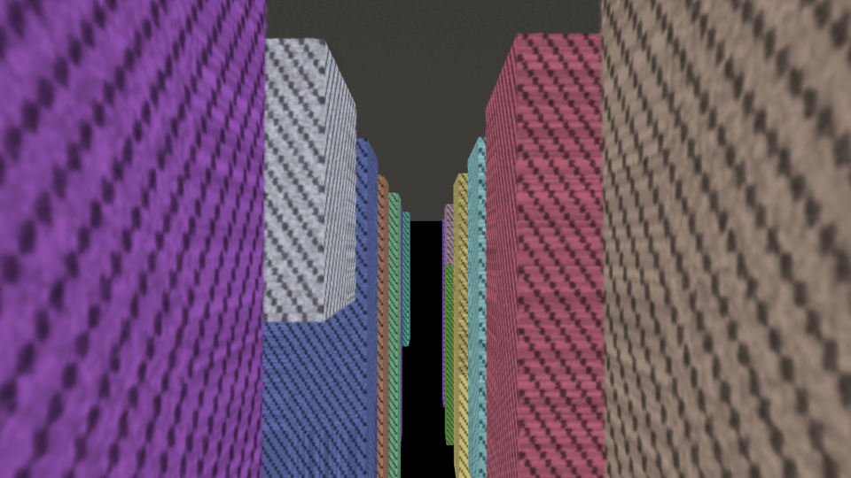
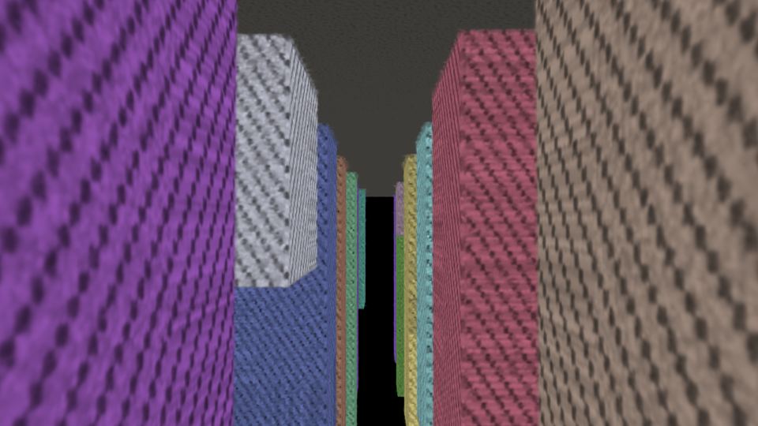
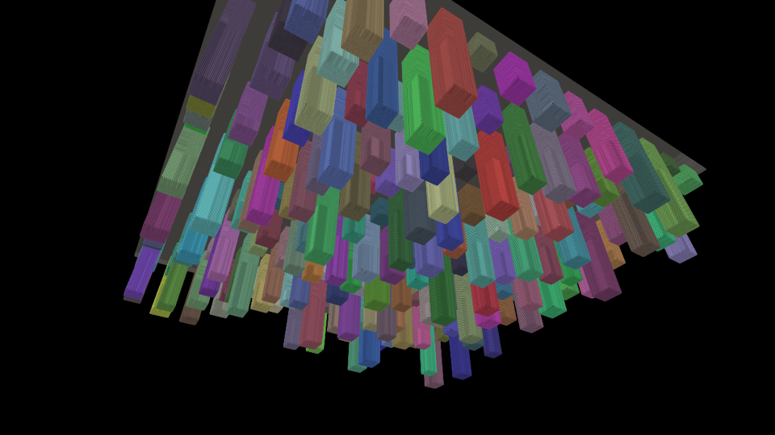

# lod_splat — budgeted LOD rendering scheme for Gaussian splats

A self-contained implementation of a perceptually-derived level-of-detail
scheme for 3D Gaussian Splatting: offline octree hierarchy with
moment-matched merged splats, per-frame budgeted cut selection, a chunked
streaming layer, and stateless dissolve-based temporal stability.
Includes a CPU reference rasterizer and a profiling harness.

The module is **portable C++20 with no dependencies** and builds standalone —
including on macOS, where the main LichtFeld-Studio application cannot compile
(its build requires CUDA: `project(... LANGUAGES CUDA CXX C)`). Splat field
semantics intentionally match `lfs::core::SplatData`: positions linear,
scales log-space, quaternions unnormalized `(w,x,y,z)`, opacity logit-space,
`sh0` = unnormalized DC coefficients; PLY I/O is property-compatible with
`src/io/formats/ply.cpp`.

## Build & run

```sh
cmake -S src/lod_splat -B build-lod -DCMAKE_BUILD_TYPE=Release
cmake --build build-lod -j
./build-lod/lod_profile --splats 30000000 --frames 600 --validate --out lod_profile_out
# real scene instead of synthetic city:
./build-lod/lod_profile --ply scene.ply --validate
```

Key flags: `--quality q` (overdraw knob), `--budget N` (hard splat cap),
`--hysteresis h`, `--band B` (dissolve width), `--bandwidth MB/s --latency ms
--resident-mb M` (streaming model), `--no-streaming`, `--validate`
(rasterizer-based quality + temporal checks), `--compare` (A/B render of the
original scheme vs the LichtFeld-ported hybrid). Per-frame metrics land in
`<out>/frames.csv`.

## 1. Target density from projection math (`camera.hpp`)

A pixel at view depth `d` covers a world-space footprint

```
w(d) = d · 2·tan(fovy/2) / H  =  d / focal_px
```

"One splat per pixel" makes `w(d)` the target splat spacing at depth `d`
(surface density ∝ 1/d²). Splats alpha-blend, so quality needs an **overdraw
factor** `q` of ~2–6 contributions per pixel; that multiplies target density
by `q`, i.e. divides target spacing by `√q`. The per-node refinement test is

```
eps = rep_extent · focal_px / dist · √q / tau_px      // refine while eps > 1
```

where `rep_extent` is the mean world extent (2σ_max) of the node's
representative splats and `dist` is camera distance to the node bounds.
Because the test uses the **representatives' actual extent**, not node size or
pure distance, a flat wall viewed edge-on keeps the density its splat extents
demand instead of coarsening into mush. `q` (`--quality`) and `tau_px`
(`--tau`) are the knobs.

## 2. Offline hierarchy (`hierarchy.{hpp,cpp}`)

Morton-sort (63-bit codes, LSD radix), top-down octree over the sorted range
(leaves ≤64 splats — the leaf size is the cut granularity; see `--leaf`),
then bottom-up construction of **merged representative splats** per interior
node via Gaussian **moment matching**:

- weights `w_i = α_i · area_i` (integrated alpha contribution)
- merged mean/covariance are the mixture moments — covariance includes the
  spread between child means, then eigendecomposes (Jacobi) back to
  scale + rotation
- merged opacity solves `α_m · area_m = Σ α_i · area_i` exactly: merged
  splats use LichtFeld/Spark's **lodOpacity** encoding (linear alpha, may
  exceed 1.0), so dense opaque clusters keep their integrated alpha instead
  of clamping at 1 (measured root/leaves conservation: 0.99 vs 0.34 clamped;
  toggle: `HierarchyParams::lod_opacity`)
- color is the alpha-weighted average (SH degree 0; higher bands are dropped
  at merged levels)

Merge partners are chosen by **Bhattacharyya similarity** within a Morton
window (ported from LichtFeld's `bhatt_lod` builder; toggle:
`HierarchyParams::similarity_pairing`), so coplanar/similar splats merge
before dissimilar neighbors and corners don't blob into mush.

`reduction = 2` source splats per representative: surface-like scenes branch
~4-way per octree level, so each level holds **half the density** of the next
finer one (verified in the build report: per-level ratio ≈ 0.500), and level
selection maps to log₂ of the footprint ratio. `reduction = 4` quarters
density per level and cuts merged-level memory from ~100% to ~33% overhead.

Leaf-size sweep on the 30M scene (street view, 1.5M budget, PSNR vs ground
truth / selection ms): 256 -> 26.7 dB / 1 ms, 64 -> 37.4 dB / 2.6 ms,
32 -> 37.3 dB / 2.8 ms, 16 -> 39.4 dB / 28 ms. Finer leaves close most of the
granularity gap to LichtFeld's per-splat binary tree (32.3 dB on the same
test, 85 s sequential build vs 2.5 s parallel here) while keeping the
parallel build; 64 is the default. Note finer leaves mean smaller streaming
chunks (~9x more requests on the flythrough) — a production pager should
aggregate chunks across nodes, as LichtFeld's 65k-splat pages do.

## 3. Cut selection under a budget (`cut.{hpp,cpp}`)

The cut is maintained **incrementally** from the previous frame:

1. **Coarsen pass** — sibling groups whose parent is below the coarsen
   threshold or fully outside the frustum merge upward (cascading).
2. **Greedy refine** — max-heap ordered by screen-space error weighted by
   screen coverage; the worst node refines first; stops at the **hard splat
   budget** (graceful degradation instead of blowing the cap). Refines whose
   children aren't resident are deferred — the parent keeps rendering.
3. **Force-coarsen** — if the budget is exceeded anyway (camera swing, budget
   drop), the cheapest sibling groups merge via a min-heap, cascading upward,
   until the working set fits.

Budget derivation: `pixels × overdraw` (e.g. 0.92M px × 3 ≈ 2.8M
contributions ⇒ ~1.5M resident splats after culling) — and the budget also
bounds the per-frame depth sort, which is the real per-frame cost.

## 4. Streaming (`streaming.{hpp,cpp}`)

Storage is chunked by **(octree node → payload)**, so the cut directly defines
the fetch set. Coarse chunks: 20 B/splat (u16 positions in node bounds, f16
log-scales, i8 quaternion, u8 opacity, u8 RGB / SH0-only). Leaf chunks:
29 B/splat (f32 positions, f16 SH0). Behaviors:

- **never holes out** — refines blocked on residency keep the parent visible,
- **LRU eviction** protecting the cut, its ancestors, and recent touches,
- **velocity prefetch** — extrapolated camera requests children whose
  predicted error enters the refine approach band (capped per frame so
  prefetch can't starve demand bandwidth).

Transfers run against a simulated latency+bandwidth channel
(`--latency/--bandwidth`) so scheduling is measurable and deterministic.

## 5. Temporal stability

Level transitions use a **continuous dissolve** ported from LichtFeld's
`lod_select_threshold` shader: a refined parent co-renders with weight `1-t`
while its children render with weight `t`, where `t` ramps over the parent's
error band `[1, 1 + dissolve_band]` (`--band`, default 0.18). Weights are a
pure function of camera pose — no temporal state, popping is impossible by
construction, and refine/coarsen switches happen at child weight ~0 where
they are visually free. Band parents are counted against the budget.
Hysteresis (refine at `eps > 1`, coarsen at `eps < 1/h`, `h = 1.5`) remains
purely as churn avoidance: on an oscillating recede-approach path the naive
selector re-refines what it just coarsened every frame; hysteresis eliminates
that (measured: 127 threshold-coarsens/frame -> 0).

## Results vs the shipped LOD method

30M-splat synthetic city, 1.5M splat budget, PSNR vs a full non-LOD render
(`--compare` reproduces; `docs/comparison/` holds the frames; bhatt reference
= the CPU port of the shipped method described below):

| view | this module (leaf=64) | bhatt reference | offline build |
|---|---|---|---|
| street (budget-saturated) | **37.4 dB** | 32.3 dB | **2.5 s** vs 85 s |
| overview | **32.0 dB** | 31.6 dB | (same builds) |

| ground truth | this module | bhatt reference |
|---|---|---|
|  |  |  |
|  |  |  |

## Validation (`--validate`, `rasterizer.{hpp,cpp}`)

EWA-style CPU reference rasterizer (perspective Jacobian, conic evaluation,
front-to-back tiled alpha blending) used to measure: PSNR of LOD cuts vs the
full model, measured contributions/pixel vs the `q` knob, and the temporal
metrics above. A startup self-test asserts the cut covers every leaf splat
exactly once and reports integrated-alpha conservation of the root.

## Integrating with LichtFeld-Studio's renderer

The module mirrors LichtFeld's existing RAD/LOD design (`SplatLodTree`,
`LodPageCache`, `GaussianLodGpuTraversalState`) but implements a different
scheme (octree + moment matching + greedy budgeted cut). Integration path:

- hierarchy build: consume `SplatData` tensors (`means`, `scaling_raw`,
  `rotation_raw`, `opacity_raw`, `sh0`) instead of `SplatCloud`,
- selection output (`DrawEntry` ranges + dissolve weights) maps onto
  `ViewportRenderRequest::lod_indices/lod_levels/lod_weights`,
- `StreamingManager` maps onto `LodPageCache` (chunk = node payload, page =
  resident decode); replace the simulated channel with zstd-on-NVMe like
  `ply_to_rad_lod`,
- per-frame depth sort is already GPU-side in LichtFeld; the budget bounds it.
